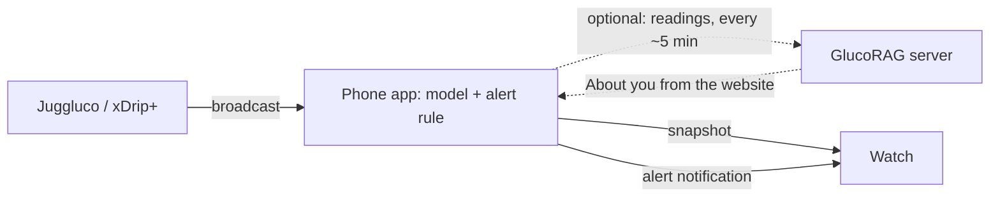

# GlucoRAG phone and watch apps

**Research prototype. Not a medical device. Don't use it to make treatment decisions.** Your CGM
app's own alarms stay the safety net; GlucoRAG's alerts only add a forecast.

- **Phone app** (`phone/`, Android 9+): receives readings from Juggluco or xDrip+, forecasts the
  next hour **on the phone** (the same model and rules as the server), posts alerts, and sends the
  watch a snapshot. A GlucoRAG server is optional: connected, the phone also uploads its readings
  and shares About you with the account.
- **Watch app** (`wear/`, Wear OS 3+; tested on Wear OS 6, which the Galaxy Watch4 Classic runs):
  two complications for your watch face ("Glucose now", "Next hour"), a tile, and an app. It never
  talks to the server; it shows what the phone sends.
- **Shared rules** (`shared/`): units, zones, trend, status wording, snapshot format, CGM broadcast
  parsing, reading thinning, and which server addresses may use plain HTTP.

Design: `../docs/superpowers/specs/2026-10-06-glucorag-wear-design.md`.



## Build

Needs JDK 17 and the Android SDK (platform 37, build-tools 36). The Gradle wrapper downloads
Gradle 9.5.1.

```sh
cd android
export JAVA_HOME=/Library/Java/JavaVirtualMachines/jdk-17.jdk/Contents/Home   # any JDK 17
./gradlew :shared:testDebugUnitTest :phone:testDebugUnitTest :wear:testDebugUnitTest \
  :phone:lintDebug :wear:lintDebug :phone:assembleRelease :wear:assembleRelease
# APKs: phone/build/outputs/apk/release/phone-release.apk (≈ 55 MB, ONNX Runtime included),
#       wear/build/outputs/apk/release/wear-release.apk (≈ 33 MB)
```

The phone APK carries ONNX Runtime for ARM phones only (`arm64-v8a`, `armeabi-v7a`; the
emulator on Apple-silicon Macs is ARM too). The unit tests run the same model on the JVM with
ONNX Runtime's desktop build.

### The model on the phone

`phone/src/main/assets/model/` holds the forecast model exported from a server artifact, and
`phone/src/test/resources/parity.json` the fixtures that prove the phone computes what the server
does. Regenerate both after promoting a new model (from the repository root):

```sh
uv pip install -e '.[export]'      # onnx, onnxruntime
glucorag-export-onnx --model models/shanghai-v1 --out android/phone/src/main/assets/model/ \
  --parity android/phone/src/test/resources/parity.json
pytest -q tests/test_export*.py    # ONNX = PyTorch within 0.001 mg/dL
```

`model.onnx` is the whole EPS-TFT (static covariate encoder included): inputs `static` (1, 4),
`x_enc` (1, 8, 2) and `x_dec` (1, 4, 1), output (1, 4, 7) normalized quantiles. `meta.json` pins
the window geometry, quantiles, glucose normalization, the static encoding and the gap limit. The
phone's `ForecastEngine` ports the server's input building exactly (nearest-slot grid with its tie
rules, causal linear extrapolation of gaps up to 60 min, local wall-clock time of day), and
`ForecastEngineParityTest` checks it against the fixtures within 0.5 mg/dL (it agrees within
0.001).

Both apps are `org.glucorag.app` and are signed with the same key (`keystore/glucorag-dev.jks`,
development only). The watch and phone apps only talk to each other when the package name and the
signing key match, so always install a pair built from the same checkout.

## 1. Choose: this phone only, or with a server

The first screen offers **Use on this phone only** and **Connect to a GlucoRAG server**.

- **This phone only** needs no account and no network: About you, readings (kept for 7 days),
  forecasts, alerts and the watch all work on the phone. **Settings → Connect to a GlucoRAG
  server** connects later: the readings kept on the phone upload (simulated ones don't), and your
  details go to the account if it has none yet (an account that has them keeps its own).
- **With a server**, readings also upload to your account, so the website shows your history and
  your clinic can see it. The forecast still runs on the phone, so it keeps working away from home.
  **Sign out** asks whether to keep your readings and details on the phone (it then goes on
  without a server) or to delete them from it.

### Running a server on your home network

On the Mac, serve on all interfaces (the default only listens on 127.0.0.1):

```sh
source .venv/bin/activate
GLUCORAG_HOST=0.0.0.0 GLUCORAG_MODEL_PATH=models/shanghai-v1 \
GLUCORAG_SIM_REPORT=reports/sim/report.json glucorag-serve
```

Allow incoming connections when macOS asks. Find the Mac's address with
`ipconfig getifaddr en0` (for example `192.168.1.20`); the phone uses `http://192.168.1.20:8000`.

Create your account on the website (`http://192.168.1.20:8000/ui/`) first. Your details (diabetes
type, age, sex and BMI) can be entered there or in the phone app.

**Plain HTTP** is accepted only for home and Tailscale addresses (10.x, 172.16–31.x, 192.168.x,
169.254.x, loopback, 100.64–127.x, `*.local`, `*.ts.net`). Any other address must use `https://`,
so your token never travels unencrypted across the internet.

**Away from home** the phone can't reach the Mac: forecasts and alerts go on as before; readings
wait on the phone and upload when you're back. To upload from anywhere, install
[Tailscale](https://tailscale.com) on the Mac and phone and use the Mac's Tailscale address, or
`tailscale serve` for HTTPS (HTTPS names are published in public certificate logs, so don't put
personal details in the machine name).

## 2. Set up the phone

Install the phone app (`adb install phone-release.apk`, with USB or wireless debugging on the phone).

1. **Connect** (only with a server): on the website, open Settings → Connected devices → **Connect
   a phone**. On the phone, tap **Scan QR code** (Google's code scanner; GlucoRAG itself needs no
   camera permission) and point it at the QR code: the phone takes the server address from it and
   signs in. Scanning the QR with the phone's camera app also opens GlucoRAG
   (`glucorag://pair?server=…&code=…`) and shows only "Pairing with 192.168.1.20:8000…"; if that
   fails, **Other ways to connect** shows the fields. If the phone is already signed in to an
   account, it asks before switching.
   - **Enter pairing code** instead: type the server address and the 8-character code shown under
     the QR (`ABCD-EFGH`; case and the dash don't matter). Codes work once and for 10 minutes.
   - **Sign in with email instead** keeps the old way: server address, **Check server** (it should
     say "Connected to GlucoRAG shanghai-v1"), email and password.
2. **About you** (on this phone only, or when the account has no profile yet): diabetes type, age,
   sex, and BMI, from height and weight (cm and kg, or feet, inches and pounds in the US, Liberia
   and Myanmar) or typed directly; and the glucose unit (mg/dL where meters customarily read it,
   mmol/L elsewhere). Settings → **Edit your details** changes them later; the alert sensitivity
   chosen on the website is kept.
3. **Where your readings come from:** GlucoRAG reads what Juggluco or xDrip+ share with other
   apps. If you only use the official Libre or Dexcom app, add one of them; both read the same
   sensors. Each only sends to apps you name. Installed apps are listed first with an **Open
   Juggluco** / **Open xDrip+** button that copies `org.glucorag.app` to the clipboard and opens
   the app, so you can paste it:
   - **Juggluco:** Settings → **Glucodata broadcast** → tick `org.glucorag.app`.
   - **xDrip+:** Settings → Inter-app settings → **Broadcast locally** on, **Identify receiver**
     = `org.glucorag.app`, **Compatible Broadcast** on. Without Identify receiver, Android doesn't
     deliver xDrip+'s broadcast to other apps.

   With neither installed, **Get Juggluco** opens Google Play and **Get xDrip+** its GitHub
   releases. The screen re-checks when you come back to it. Once the first reading arrives it says
   "Receiving readings from Juggluco" and moves on by itself (**Continue** still works).

   **No sensor at hand?** **Try with simulated readings** feeds made-up readings through the same
   path: the last 3 hours at once, then one every 5 minutes (a meal rise, then a slow fall to just
   under 70 mg/dL, so the forecast and the low alert have something to do). When connected they
   upload to your account like real readings. Today shows "Simulated readings, not from a sensor"
   with **Stop** while they run; Settings has a switch.
4. **Keep readings flowing:**
   - allow notifications;
   - set the app's battery use to **Unrestricted**;
   - Samsung phones only: add GlucoRAG to **Never sleeping apps** (the button opens the list), and
     in Galaxy Wearable → Notifications → App notifications make sure GlucoRAG is on, with **Show
     while using phone** so alerts reach the watch while you use the phone. Other phones show a
     general watch-notifications step. **Send test alert** checks it;
   - **Install GlucoRAG on your watch:** with a server, **Open the watch guide** opens the
     website's `/ui/help/watch`; without one, the step lists what to do (section 3 below).

The phone keeps about one reading per 5 minutes (enough for the 15-minute model) and forecasts
after each one.

### Alerts

The phone raises alerts itself with the server's rule (`glucorag/risk/detectors.py`): a low when
the lower edge your sensitivity selects (standard q0.25, cautious q0.10, very cautious q0.02)
reaches 70 mg/dL within the hour, a high when the upper one (q0.75 / q0.90 / q0.98) reaches 180
**and** at least 190 somewhere. No low alert while the reading is already ≤ 70, no high alert
while it is already ≥ 180 (Today says so). Each type alerts once when it starts, at most every 30
minutes, and only from a reading at most 15 minutes old. Notifications read "Low likely in about
25 min (could reach 66 mg/dL)." in your unit. Server alerts are no longer notified on the phone.

## 3. Install the watch app (Galaxy Watch4 Classic)

1. On the watch: Settings → About watch → Software information → tap **Software version** 5 times
   to enable Developer options.
2. Settings → Developer options: turn on **ADB debugging**, turn **off automatic Wi-Fi** (or the
   watch drops Wi-Fi while connected to the phone), then **Wireless debugging** → **Pair new
   device**. The watch and Mac must be on the same Wi-Fi.
3. On the Mac (adb 30 or later):
   ```sh
   adb pair <watch-ip>:<pairing-port>      # enter the pairing code shown on the watch
   adb connect <watch-ip>:<connection-port> # a different port, shown on the Wireless debugging screen
   adb -s <watch-ip>:<connection-port> install -r wear/build/outputs/apk/release/wear-release.apk
   ```
   Reconnect after restarting wireless debugging or changing networks.
4. Open GlucoRAG on the watch once and accept the research notice.
5. Long-press the watch face → **Customise** → choose a complication slot → **GlucoRAG**: "Glucose
   now" (value, arrow and age) and "Next hour" (e.g. `Low` / `15m`). Faces with round slots take
   the short forms; large or edge slots take the sentence. Swipe to the tiles to add the GlucoRAG
   tile.

## What you see

| Situation | Watch / phone says |
|---|---|
| Low or high likely | "Heading below 70 in about 25 min (could reach 66)." / "Heading above 180 in about 15 min (could reach 205)." (thresholds in your unit; the watch face counts down live: "Below 70 in 14m") |
| Already at or past 70 or 180 | "198 mg/dL, steady. Likely about 185 in 30 min." |
| Forecast in range | "In range for the next hour." |
| Fewer than 2 hours of readings | "Collecting readings" |
| A gap of over an hour in the last 2 hours | "No current forecast" |
| No reading for 15 min | "No recent reading", value greyed |
| No details entered yet | Watch: "Open GlucoRAG on your phone"; phone: "Enter your details to see your forecast" |

## Testing without a phone–watch pair

Pairing emulators needs a Google Play phone image, a Google sign-in, the Pixel Watch app and
Android Studio's pairing assistant. Debug builds of the watch app accept a snapshot over adb
instead, through the same code path as the phone's:

```sh
adb -s <watch> shell am broadcast -a org.glucorag.wear.DEBUG_SNAPSHOT -p org.glucorag.app \
  --es json "$(cat scripts/snapshots/low-soon.json)"
```

`scripts/snapshots/` holds snapshots for several states (times are absolute; shift them to now). Send
CGM readings to the phone the same way the CGM apps do:

```sh
adb shell am broadcast -n org.glucorag.app/.source.GlucoseReceiver -a glucodata.Minute \
  --ei glucodata.Minute.mgdl 142 --el glucodata.Minute.Time $(($(date +%s)*1000)) --ef glucodata.Minute.Rate 0.4
adb shell am broadcast -n org.glucorag.app/.source.GlucoseReceiver -a com.eveningoutpost.dexdrip.BgEstimate \
  --ed com.eveningoutpost.dexdrip.Extras.BgEstimate 142.0 --el com.eveningoutpost.dexdrip.Extras.Time $(($(date +%s)*1000)) \
  --ed com.eveningoutpost.dexdrip.Extras.BgSlope 6.7e-6
```

`screenshots/` holds the emulator run: the phone (Android 15, light and dark) and the watch
(Wear OS 6 at 450 px and 396 px, the 46 mm and 42 mm screens) in every state.

## Known limits

- **Not verified on real hardware.** The phone→watch Data Layer link and notification mirroring
  were not tested on a paired phone and watch; Samsung's own watch faces were not tested (Google's
  Wear OS 6 faces were).
- **Phone and watch data may pass through Google's servers:** when Bluetooth is unavailable, the
  Wear OS Data Layer routes the snapshot through Google Cloud (end-to-end encrypted).
- **Any app on the phone can send a fake reading** to GlucoRAG's receiver: Android doesn't tell the
  receiver who sent a broadcast. Values outside 20–600 mg/dL or in the future are dropped.
- **The model is part of the app.** A newly trained model reaches the phone only with a new app
  build (export it as above); the server's model version can differ from the phone's meanwhile.
- The development signing key is in the repository: build release APKs with your own key.
