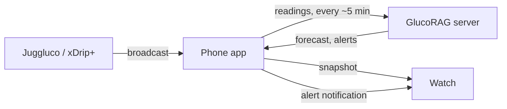

# GlucoRAG phone and watch apps

**Research prototype. Not a medical device. Don't use it to make treatment decisions.** Your CGM
app's own alarms stay the safety net; GlucoRAG's alerts only add a forecast.

- **Phone app** (`phone/`, Android 9+): receives readings from Juggluco or xDrip+, uploads them to
  your GlucoRAG server, gets the forecast back, posts alerts, and sends the watch a snapshot.
- **Watch app** (`wear/`, Wear OS 3+; tested on Wear OS 6, which the Galaxy Watch4 Classic runs):
  two complications for your watch face ("Glucose now", "Next hour"), a tile, and an app. It never
  talks to the server; it shows what the phone sends.
- **Shared rules** (`shared/`): units, zones, trend, status wording, snapshot format, CGM broadcast
  parsing, upload thinning, and which server addresses may use plain HTTP.

Design: `../docs/superpowers/specs/2026-10-06-glucorag-wear-design.md`.



## Build

Needs JDK 17 and the Android SDK (platform 37, build-tools 36). The Gradle wrapper downloads
Gradle 9.5.1.

```sh
cd android
export JAVA_HOME=/Library/Java/JavaVirtualMachines/jdk-17.jdk/Contents/Home   # any JDK 17
./gradlew :shared:testDebugUnitTest :phone:testDebugUnitTest :wear:testDebugUnitTest \
  :phone:lintDebug :wear:lintDebug :phone:assembleDebug :wear:assembleDebug
# APKs: phone/build/outputs/apk/debug/phone-debug.apk, wear/build/outputs/apk/debug/wear-debug.apk
```

Both apps are `org.glucorag.app` and are signed with the same key (`keystore/glucorag-dev.jks`,
development only). The watch and phone apps only talk to each other when the package name and the
signing key match, so always install a pair built from the same checkout.

## 1. Run the server on your home network

On the Mac, serve on all interfaces (the default only listens on 127.0.0.1):

```sh
source .venv/bin/activate
GLUCORAG_HOST=0.0.0.0 GLUCORAG_MODEL_PATH=models/shanghai-v1 \
GLUCORAG_SIM_REPORT=reports/sim/report.json glucorag-serve
```

Allow incoming connections when macOS asks. Find the Mac's address with
`ipconfig getifaddr en0` (for example `192.168.1.20`); the phone uses `http://192.168.1.20:8000`.

Create your account on the website (`http://192.168.1.20:8000/ui/`) first. Your details (diabetes
type, age, sex and BMI) can be entered there or in the phone app.

**Plain HTTP** is accepted only for home and Tailscale addresses (10.x, 172.16–31.x, 192.168.x,
169.254.x, loopback, 100.64–127.x, `*.local`, `*.ts.net`). Any other address must use `https://`,
so your token never travels unencrypted across the internet.

**Away from home** the phone can't reach the Mac: the watch still shows your current reading and
says "Forecast needs your GlucoRAG server"; readings wait on the phone and upload when you're back.
For forecasts anywhere, install [Tailscale](https://tailscale.com) on the Mac and phone and use the
Mac's Tailscale address, or `tailscale serve` for HTTPS (HTTPS names are published in public
certificate logs, so don't put personal details in the machine name).

## 2. Set up the phone

Install the phone app (`adb install phone-debug.apk`, with USB or wireless debugging on the phone).

1. **Connect:** on the website, open Settings → Connected devices → **Connect a phone**. On the
   phone, tap **Scan QR code** (Google's code scanner; GlucoRAG itself needs no camera permission)
   and point it at the QR code: the phone takes the server address from it and signs in. Scanning
   the QR with the phone's camera app also opens GlucoRAG (`glucorag://pair?server=…&code=…`); if
   the phone is already signed in to an account, it asks before switching.
   - **Enter pairing code** instead: type the server address and the 8-character code shown under
     the QR (`ABCD-EFGH`; case and the dash don't matter). Codes work once and for 10 minutes.
   - **Sign in with email instead** keeps the old way: server address, **Check server** (it should
     say "Connected to GlucoRAG shanghai-v1"), email and password.
   - When the website runs on `localhost`, the QR carries the Mac's LAN address; set
     `GLUCORAG_PUBLIC_URL` on the server when that guess is wrong (for example with Tailscale).
2. **About you** (only if the account has no profile yet): diabetes type, age, sex, and BMI, from
   height and weight (cm and kg, or feet, inches and pounds in the US, Liberia and Myanmar) or typed
   directly; and the glucose unit (mg/dL where meters customarily read it, mmol/L elsewhere).
3. **Where your readings come from:** GlucoRAG reads what Juggluco or xDrip+ share with other
   apps. If you only use the official Libre or Dexcom app, add one of them; both read the same
   sensors. Each only sends to apps you name. Installed apps are listed first with an **Open
   Juggluco** / **Open xDrip+** button that copies `org.glucorag.app` to the clipboard and opens
   the app, so you can paste it:
   - **Juggluco:** Settings → **Glucodata broadcast** → tick `org.glucorag.app`.
   - **xDrip+:** Settings → Inter-app settings → **Broadcast locally** on, **Identify receiver**
     = `org.glucorag.app`, **Compatible Broadcast** on. Without Identify receiver, Android doesn't
     deliver xDrip+'s broadcast to other apps.

   With neither installed, **Get Juggluco** opens Google Play and **Get xDrip+** its GitHub
   releases. The screen re-checks when you come back to it. Once the first reading arrives it says
   "Receiving readings from Juggluco" and moves on by itself (**Continue** still works).

   **No sensor at hand?** **Try with simulated readings** feeds made-up readings through the same
   path: the last 3 hours at once, then one every 5 minutes (a meal rise, then a slow fall to just
   under 70 mg/dL, so the forecast and the low alert have something to do). They upload to your
   account like real readings. Today shows "Simulated readings, not from a sensor" with **Stop**
   while they run; Settings has a switch; signing out stops them.
4. **Keep readings flowing:**
   - allow notifications;
   - Samsung: add GlucoRAG to **Never sleeping apps** (the button opens the list), and set the
     app's battery use to **Unrestricted**. Sleeping apps lose background work, so uploads stop;
   - Galaxy Wearable → Notifications → App notifications: make sure GlucoRAG is on, and turn on
     **Show while using phone** so alerts reach the watch while you use the phone. **Send test
     alert** checks it.

Readings upload about every 5 minutes (one per 5 minutes is enough for the 15-minute model).
Alerts buzz for a predicted low or high of medium or high severity, once per alert, and only while
the reading they came from is at most 15 minutes old.

## 3. Install the watch app (Galaxy Watch4 Classic)

1. On the watch: Settings → About watch → Software information → tap **Software version** 5 times
   to enable Developer options.
2. Settings → Developer options: turn on **ADB debugging**, turn **off automatic Wi-Fi** (or the
   watch drops Wi-Fi while connected to the phone), then **Wireless debugging** → **Pair new
   device**. The watch and Mac must be on the same Wi-Fi.
3. On the Mac (adb 30 or later):
   ```sh
   adb pair <watch-ip>:<pairing-port>      # enter the pairing code shown on the watch
   adb connect <watch-ip>:<connection-port> # a different port, shown on the Wireless debugging screen
   adb -s <watch-ip>:<connection-port> install -r wear/build/outputs/apk/debug/wear-debug.apk
   ```
   Reconnect after restarting wireless debugging or changing networks.
4. Open GlucoRAG on the watch once and accept the research notice.
5. Long-press the watch face → **Customise** → choose a complication slot → **GlucoRAG**: "Glucose
   now" (value, arrow and age) and "Next hour" (e.g. `Low` / `15m`). Faces with round slots take
   the short forms; large or edge slots take the sentence. Swipe to the tiles to add the GlucoRAG
   tile.

## What you see

| Situation | Watch / phone says |
|---|---|
| Low or high predicted | "Low predicted in 25 min" (the countdown keeps running on the watch face) |
| Already past 70 or 180 | "Low now" / "High now" |
| Band in range | "In range for the next hour" |
| Fewer than 2 hours of readings | "Collecting readings" |
| Server unreachable | "Forecast needs your GlucoRAG server" (current value still shown) |
| No reading for 15 min | "No recent reading", value greyed |
| Signed out on the server | Watch: "Open GlucoRAG on your phone"; phone: "Sign in again to see your forecast" |

## Testing without a phone–watch pair

Pairing emulators needs a Google Play phone image, a Google sign-in, the Pixel Watch app and
Android Studio's pairing assistant. Debug builds of the watch app accept a snapshot over adb
instead, through the same code path as the phone's:

```sh
adb -s <watch> shell am broadcast -a org.glucorag.wear.DEBUG_SNAPSHOT -p org.glucorag.app \
  --es json "$(cat scripts/snapshots/low-soon.json)"
```

`scripts/snapshots/` holds one snapshot per state (times are absolute; shift them to now). Send
CGM readings to the phone the same way the CGM apps do:

```sh
adb shell am broadcast -n org.glucorag.app/.source.GlucoseReceiver -a glucodata.Minute \
  --ei glucodata.Minute.mgdl 142 --el glucodata.Minute.Time $(($(date +%s)*1000)) --ef glucodata.Minute.Rate 0.4
adb shell am broadcast -n org.glucorag.app/.source.GlucoseReceiver -a com.eveningoutpost.dexdrip.BgEstimate \
  --ed com.eveningoutpost.dexdrip.Extras.BgEstimate 142.0 --el com.eveningoutpost.dexdrip.Extras.Time $(($(date +%s)*1000)) \
  --ed com.eveningoutpost.dexdrip.Extras.BgSlope 6.7e-6
```

`screenshots/` holds the emulator run: the phone (Android 15, light and dark) and the watch
(Wear OS 6 at 450 px and 396 px, the 46 mm and 42 mm screens) in every state.

## Known limits

- **Not verified on real hardware.** The phone→watch Data Layer link and notification mirroring
  were not tested on a paired phone and watch; Samsung's own watch faces were not tested (Google's
  Wear OS 6 faces were).
- **Phone and watch data may pass through Google's servers:** when Bluetooth is unavailable, the
  Wear OS Data Layer routes the snapshot through Google Cloud (end-to-end encrypted).
- **Any app on the phone can send a fake reading** to GlucoRAG's receiver: Android doesn't tell the
  receiver who sent a broadcast. Values outside 20–600 mg/dL or in the future are dropped.
- **The forecast needs your server.** Prediction runs only on the server; nothing is predicted on
  the phone.
- The development signing key is in the repository: build release APKs with your own key.
