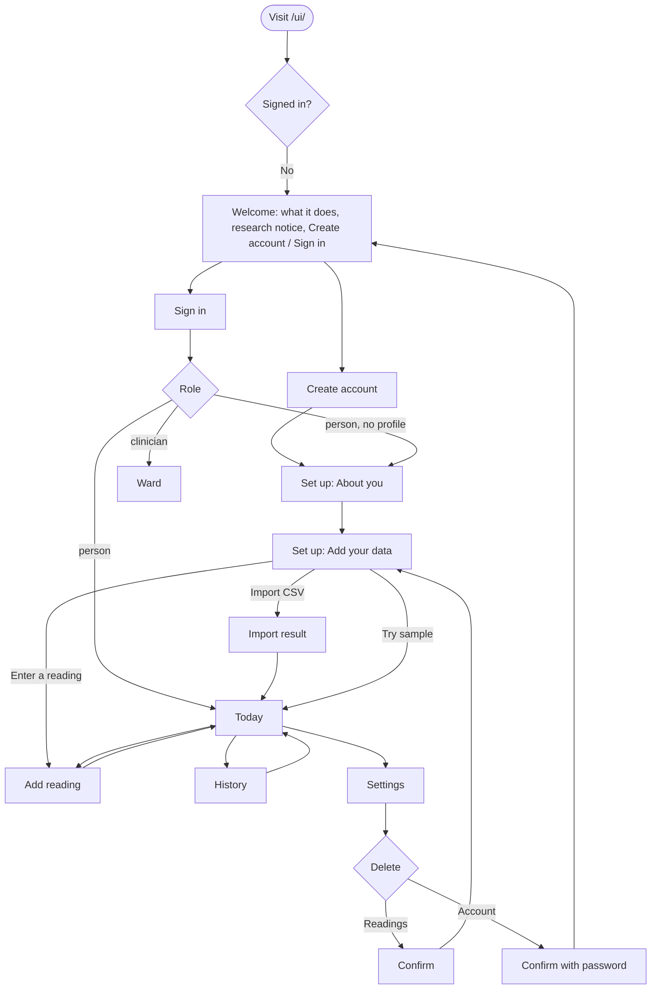

# GlucoRAG app: personal glucose forecasting

- **Status:** requested 2026-10-05.
- **The ask:** "an actual application where one can actively use and see, predict their glucose level; design the application and build the project entirely; rewrite the design if required."
- **Supersedes:** the API-key-only staff dashboard as the product's front door. The staff surface stays but moves behind clinician accounts.
- **Product truth:** `web/PRODUCT.md`, rewritten in this change.

The "Direction contract" is development-only. Never copy its wording into shipped source, comments, DOM, data attributes or bundles.

## What changes, and why
The earlier build was a monitoring console. Only an operator holding an API key could use it, and data arrived only by script. Nobody could sign up, add their own glucose, and get a forecast. This change makes the product usable end to end by one person:
- create an account;
- describe themselves (the model's static inputs);
- get readings in, by any of these routes:
  - typing a single reading;
  - importing their sensor's CSV (FreeStyle LibreView, Dexcom Clarity, generic);
  - loading a 48-hour sample trace to try it;
- see their next hour predicted, with an honest uncertainty band and the alert rule applied;
- export or delete all of it.

Clinician accounts keep the ward/alerts/model/system pages. API keys remain for devices and scripts.

## Backend contract (shipped and tested in this change)
- **Accounts:**
  - `POST /auth/register`, `POST /auth/login`, `POST /auth/logout`, `GET /auth/me`, `POST /auth/password`.
  - Session is an HttpOnly `SameSite=Strict` cookie. Writes made with the cookie require a same-origin `Origin` header when one is sent.
  - Logins are throttled at 5 failures per 15 min per email. Errors don't reveal whether an email has an account.
  - Self-registration creates only `person` accounts. `glucorag-admin create-clinician` creates staff accounts.
- **Personal API (`/me`):**
  - `GET /me`: account, profile, reading count, first/last time, model facts.
  - `PUT /me/profile`: age, gender F/M, BMI, T1D/T2D, sensitivity standard/cautious/very_cautious, unit.
  - `GET /me/status`: the `PatientRisk` row, the full latest prediction, `fresh`, alert quantiles, `now`, model facts.
  - `GET /me/history?hours=`: readings in the hours up to the latest reading.
  - `GET /me/alerts`, `POST /me/readings`.
  - `POST /me/import?tz=&unit=` (text/csv body).
  - `POST /me/sample` (only into an empty account).
  - `GET /me/export`, `DELETE /me/readings`, `DELETE /me` (password confirmation).
  - **Every `/me` datetime is offset-aware ISO**, so it shows in the browser's own time zone. Staff routes keep naive server-local times.
- **Sensitivity to alert quantiles:**

  | Setting | Hypo quantile | Hyper quantile |
  |---|---|---|
  | standard | q0.25 | q0.75 |
  | cautious | q0.10 | q0.90 |
  | very cautious | q0.02 | q0.98 |

  A wider band warns earlier and more often.

## Direction contract
- **THESIS.** One person, one question: "Where will I be in an hour?" The home screen answers it with a single large forecast figure: the next-hour range drawn as an AGP band on the person's own recent trace, with one plain sentence above it. This rejects the health-app default of a stat-card dashboard ringed by rings, streaks and badges.
- **OWN-WORLD.** The established GlucoRAG world, unchanged. This is an extension, not a new identity:
  - clinical white sheets on a cool blue-grey ground, navy ink;
  - AGP percentile blues for forecast ribbons;
  - the five consensus zone colours as the only status palette;
  - Atkinson Hyperlegible Next with tabular numerals;
  - lucide line icons;
  - hairline rules, 4px radius, one sheet shadow.
- **STORY.** A person signs up, answers four questions about themselves, and loads their sensor export (or the sample). Within seconds they see their glucose now, its direction, and the band they will most likely be in over the next hour. If the band crosses 70 or 180, a sentence names when and by how much.
- **FIRST VIEWPORT (Today, desktop):**
  - Left column, the answer: status sentence; "Now" value (2.75rem) with trend arrow and age; "In 30 min" and "In 60 min" values with their ranges.
  - Right two-thirds: the chart, last 3 h of readings plus the forecast fan, so the forecast takes a quarter of the width. The fan is the visual focus. Revised from 6 h after the first live render, where the fan was a sliver.
  - Above the fold: the add-reading button and the data source line ("Last reading 4 min ago, from your import").
- **FORM.** A standard product shell, the same as staff but with fewer items:
  - Desktop: left rail with Today, History, Add data, Settings.
  - Mobile: bottom tab bar.
  - Staff accounts additionally see Ward, Alerts, Model, System under a "Clinical" heading in the rail.
- **SIGNATURE.** The forecast fan: the AGP ribbons extending from the last reading into the next hour, over the zone tints.

## Information architecture and flows

### Screen inventory
| Screen | Route | Type | Purpose |
|---|---|---|---|
| Welcome | `/welcome` | Persuade-lite | What it does, who it is for, the research notice. CTAs: Create account, Sign in. |
| Create account | `/signup` | Form | Email, password (min 10, show/hide), research acknowledgement checkbox (required). |
| Sign in | `/signin` | Form | Email, password. Throttle and incorrect-credentials messages. |
| Set up 1: About you | `/setup` | Form | Diabetes type, age, sex (F/M; the model was trained on these only), BMI or height + weight (computes BMI), units. Each field explains why the forecast needs it. |
| Set up 2: Add your data | `/setup/data` | Choice | Three equal options: Import from your sensor, Try with sample data, Enter readings yourself. |
| Today | `/` (person) | Dashboard | The answer (see first viewport). Below: forecast table (`
`), last 24 h time in ranges, latest alerts. |
| History | `/history` | Detail | Window 24 h / 3 d / 7 d / 14 d. Readings chart with zone tints; time-in-ranges bar; statistics (mean, GMI = 3.31 + 0.02392 × mean mg/dL, coefficient of variation, readings count, coverage); alert list. |
| Add data | `/add` | Form + choice | Two tabs. **Enter a reading:** value, unit, time (defaults to now). **Import a file:** drop zone, format help for LibreView/Clarity, time zone (detected; editable), unit (auto/mg/dL/mmol/L), result summary. |
| Settings | `/settings` | Settings | Profile (same form as setup 1); alert sensitivity (3 radio cards with plain explanations); units; export CSV; change password; delete readings; delete account. |
| Staff pages | `/ward` … | (existing) | Ward moves from `/` to `/ward` and the existing staff pages are kept. They are reachable only by clinicians; a person who navigates there sees a 403 page. |

### States, every screen
| State | Response |
|---|---|
| Loading | Skeleton blocks at final geometry, no spinners in content. |
| No profile | Redirect to `/setup`. |
| No readings | Today shows the "Add your data" choices inline, not an empty chart. |
| Warming up (< 2 h of readings) | Today shows readings so far, plus: "Forecasts start once there are 2 hours of readings. N more needed, about H h M min." |
| Stale (latest reading older than the gap limit) | The chart shows history only. Text: "No forecast: your latest reading is 3 h old. Forecasts need a reading within the last hour. Add a reading or import a newer file." |
| Imported old data (all readings in the past) | Same as stale, worded for imports: "Your data ends 12 Mar, 14:30. The forecast below was made then." The past forecast still shows, labelled "Forecast made at 12 Mar, 14:30", because it's useful for checking the model against what happened. |
| Error | Inline sentence naming the problem and the recovery, plus a retry button. 401 goes to sign-in with "Your session ended. Sign in again." |
| Rejected reading | Field-level message from the backend reason: duplicate, out of order, in the future, non-finite. |
| Import errors | The importer's message verbatim, plus a link to format help. |
| Destructive actions | Confirmation `<dialog>` naming the exact consequence ("Delete 1,204 readings, all forecasts and alerts. Your account and settings stay."). Account deletion requires the password. |

## Copy dictionary (sentence case, plain words)
- **Status sentence (Today):**

  | Situation | Sentence |
  |---|---|
  | at_risk hypo | "Low predicted in 25 min" |
  | at_risk hyper | "High predicted in 15 min" |
  | at_risk, current value already past the threshold (inclusive, same rule as alerts) | "High now" / "Low now" |
  | ok | "In range for the next hour" |
  | warming_up | "Collecting readings" |
  | stale/data_gap | "No current forecast" |
  | no_data | "No readings yet" |

  Use "low"/"high" for the person, "hypo"/"hyper" for clinicians.
- **Risk detail:** "Your forecast band (q0.25) reaches 64 mg/dL in 25 min, 6 below 70." For people, phrase the quantile as "the lower edge of your forecast band"; show `q0.25` only in the expandable details.
- **Trend:** "rising quickly / rising / steady / falling / falling quickly", with the rate in the unit per minute.
- **Severity for people:** shown as timing, not labels. Severity high gives "soon" emphasis with zone fill; medium and low give the plain sentence.
- **Research notice:** always visible in the rail footer, the mobile top area, the welcome page and sign-up. Text: "Research prototype. Not a medical device. Do not use it to make treatment decisions." The sign-up checkbox reads: "I understand this is a research prototype and not for treatment decisions."
- **Buttons:**
  - "Create account", "Sign in", "Continue", "Import file", "Load sample data", "Add reading", "Save changes", "Export readings", "Delete readings", "Delete account", "Sign out".
  - The confirm buttons repeat the action.

## Units
mmol/L is first-class. The unit is stored per user. Every value, axis, threshold label and input converts with mg/dL = mmol/L × 18.0182; mmol/L shows one decimal, mg/dL none. The zone thresholds display as 3.0 / 3.9 / 10.0 / 13.9 mmol/L, which are the consensus rounded equivalents.

## Engineering rules
- Keep: tokens, fonts, icons, the strip, ForecastChart (generalised to unit plus a past-forecast label), time-in-ranges, time library, zones/trend/tir/envelope libs.
- **Auth model change:**
  - The SPA authenticates with the session cookie (`credentials: 'same-origin'`).
  - The sessionStorage API key path is removed from the web app; devices and scripts still use `X-API-Key` against the API.
  - A 401 on any request clears client state and routes to sign-in.
- **Routing:** `/welcome`, `/signup`, `/signin`, `/setup`, `/setup/data`, `/`, `/history`, `/add`, `/settings`. Staff: `/ward`, `/patients/:id`, `/alerts`, `/model`, `/system`. Role gates go in the router.
- **Polling:** Today and History poll `/me/status` every 30 s while the tab is visible, with a pause control. Staff pages keep their 15 s polling.
- **Pure logic** goes in `src/lib/` with boundary tests:
  - unit conversion and formatting;
  - BMI from height/weight (cm/kg and ft-in/lb);
  - GMI and CV;
  - coverage percent;
  - the readings-needed / time-to-forecast calculation;
  - time-zone detection fallback;
  - setup routing decision (role × profile × readings).
- **CSP:** unchanged (no inline scripts or eval, self-hosted assets). The file input and drop zone read files client-side and POST them as `text/csv`.

## Acceptance
- **Web checks:** `npm ci && npm run lint && npm run typecheck && npm test && npm run build` green; no inline `<script>`; Python suite green.
- **Real end-to-end run in a browser** against `glucorag-serve` with a fresh DB and `GLUCORAG_CLOCK=wall`, without API keys:
  1. Sign up, then set up.
  2. Import a LibreView-format CSV generated from `glucorag/data/sample/sample_cgm.csv` with `mmol/L` values and DD-MM-YYYY dates whose last row is now. Verify the forecast appears and values show in mmol/L.
  3. Add a manual reading.
  4. Switch the unit.
  5. Change sensitivity and see the band edges move.
  6. Delete readings, then load the sample, then export.
  7. Sign out, then sign back in.
  8. Delete the account.
  9. Create a clinician with `glucorag-admin`, sign in, see the ward including the person's patient while that person exists, and confirm a person account gets 403 on staff pages.
- **Screenshots** of every person screen at 1440 and 390, light and dark, plus the key states: warming up, stale/imported-old, at-risk, rejected reading, import error. Console has 0 errors and 0 CSP violations.
