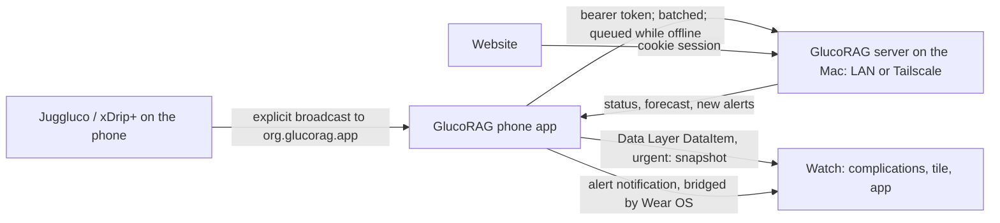

# GlucoRAG on the wrist: Wear OS watch app and Android phone companion

- **Status:** requested 2026-10-06; fact-checked 2026-10-07. Every claim below was checked against primary sources: platform docs, vendor docs, AOSP/androidx source, the xDrip+ and Juggluco source code, and our own code by execution. The evidence is in §9.
- **The ask:** "make a Wear OS application (Samsung Galaxy Watch 4 Classic), used for monitoring and predictions, with a companion application (the website or an Android application). Design the overall project, modify the existing design accordingly and build the project."
- **User decisions:** live readings come from a **phone app that bridges the CGM**; the companion is **the website plus an Android phone app**; the server runs **on the user's Mac on home Wi-Fi**.
- **Extends:** `2026-10-05-glucorag-personal-app-design.md` (accounts, `/me` API, website). Nothing there is removed.

## 1. Architecture



### Why this shape
| Project | Glucose from | Watch link | Lesson taken |
|---|---|---|---|
| Juggluco | Sensor over Bluetooth | Watch app coupled to the phone app | The phone acts as hub on Android |
| GlucoDataHandler | Juggluco / xDrip+ broadcasts, cloud followers | Phone → watch | Broadcasts are the live source; complications are the main surface |
| Gluroo | Vendor clouds | Phone → watch | It admits stale data may go unmarked, so staleness must be first-class |
| AndroidAPS | CGM broadcasts | Each wear app talks to its own phone app | Prediction can run on the phone (phase 2 here) |
| NightWear | Nightscout cloud | Standalone watch | Standalone only pays off with a cloud source |

### Decisions
1. **The phone is the hub.** The watch never talks to the server; without the phone there are no new readings anyway. The watch manifest sets `com.google.android.wearable.standalone=false`.
2. **The live source is CGM-app broadcasts, and the user must register GlucoRAG in the CGM app.** Both apps send only to package IDs the user enters.
   - **Juggluco:** `glucodata.Minute`, or its xDrip+ imitation. Settings → "Glucodata broadcast" → tick `org.glucorag.app`.
   - **xDrip+:** `com.eveningoutpost.dexdrip.BgEstimate`. Inter-app settings → Broadcast locally ON, **Identify receiver = `org.glucorag.app`**, Compatible Broadcast ON (the default). With Identify receiver empty, xDrip+ sends an implicit broadcast, which a manifest receiver never gets on Android 8+.
   - **Not in this build:**
     - Health Connect: Dexcom shares to it with a three-hour delay; no Libre Health Connect glucose export is published; reading needs a privacy-policy activity plus a separate background-read permission (API 35+).
     - LibreLinkUp and Dexcom Share: unofficial APIs, and the user's CGM-vendor password would have to be stored.
   - People who use only the official Libre or Dexcom app add Juggluco or xDrip+; setup says so.
3. **Inference stays on the server.** On-phone inference (the model is 1.2 MB) would need a second, exactly matching preprocessing implementation; that is phase 2.
4. **Away from home:**
   - The watch still gets the current value and trend from the broadcast.
   - The forecast reads "Forecast needs your GlucoRAG server".
   - Readings queue and upload on return; the backfill replays forecasts and alerts.
   - Tailscale gives forecasts anywhere: documented, with HTTPS via `tailscale serve` recommended.
5. **Staleness is first-class:**
   - Every surface shows the reading's age, or its time on the tile.
   - Values grey out after 15 min.
   - A forecast is hidden once its last horizon has passed.
6. **Alerts** are the server's predictive alerts, posted by the phone. Wear OS bridges them to the watch.
   - They supplement the CGM app's own alarms and never replace them; the text says so.
   - **Vibrating notifications go only to severity high and medium.** `glucorag/risk/detectors.py`: high = beyond 54/250 within 30 min; medium = first crossing within 30 min, or beyond 54/250 later.
   - **Low severity** (only a 70/180 crossing, first at 45–60 min) shows on the watch and phone status but doesn't buzz. The forecast at those horizons is the least accurate (test RMSE 21 mg/dL at 60 min vs 12 at 30), so buzzing would mean many false alarms.

### Platform rules this design depends on
- **Pairing:** the phone and watch apps share one application ID (`org.glucorag.app`) and one signing key; the Data Layer requires both. One shared keystore is used for debug and release.
- **Snapshot transport:**
  - A Data Layer **DataItem** at `/glucorag/snapshot`, written with **`setUrgent()`**. Without it the system may delay syncing by up to 30 min.
  - The payload is under 2 KB (limit 100 KB).
  - When Bluetooth is unavailable the Data Layer may route it **through Google Cloud, end-to-end encrypted**; this is stated in the privacy notes and the risk register.
- **Update rates:**
  - The phone writes a snapshot on each *queued* reading (≈ every 5 min), on each server response that changes it, and on each status change, never once per Juggluco minute.
  - The watch pushes complication updates at most once per 5 min on average (Wear OS guidance), immediately on a status change, and the tile at most once per minute.
- **Plain HTTP:**
  - Android's network security config can only allow it per exact host, per domain suffix, or globally; there is no IP-range support. The app allows it globally in the config.
  - In code, `http://` is accepted only for private LAN (10/8, 172.16/12, 192.168/16), link-local, loopback, Tailscale (100.64/10, fd7a:115c:a1e0::/48, `*.ts.net`) and `*.local` hosts. Everything else must be `https://`.
- **Background execution:**
  - The receiver uses `goAsync()` (≤ 10 s) only to parse, insert into Room and enqueue.
  - The upload is a unique WorkManager job with **`ExistingWorkPolicy.KEEP`**, so a running upload is never cancelled; the worker drains the whole queue.
  - The job is expedited with `OutOfQuotaPolicy.RUN_AS_NON_EXPEDITED_WORK_REQUEST`, plus a `getForegroundInfo()` on a low-importance "Sync" channel, which Android 9–11 requires.
- **Samsung battery:**
  - Setup asks the user to add GlucoRAG to **Never sleeping apps**, through Samsung's documented deep link (`com.samsung.android.sm.ACTION_OPEN_CHECKABLE_LISTACTIVITY`, package `com.samsung.android.lool`, `activity_type=2`), falling back to the app's battery page.
  - It also asks to set **Battery → Unrestricted**.
  - Sleeping apps lose jobs, alarms and foreground services; an unused app also drifts into standby buckets with network disabled.
- **Broadcast visibility:**
  - The receiver is exported, with intent-filter actions exactly `glucodata.Minute` and `com.eveningoutpost.dexdrip.BgEstimate`.
  - The manifest declares `<queries>` for `tk.glucodata` and `com.eveningoutpost.dexdrip`. Delivery depends on the *sender* seeing us, which both senders already do; ours is kept because Juggluco documents it and we use it to detect the installed app.
  - It also declares `uses-permission com.eveningoutpost.dexdrip.permissions.RECEIVE_BG_ESTIMATE`, for xDrip+ with Compatible Broadcast off.
- **Notifications:**
  - The phone requests `POST_NOTIFICATIONS` (Android 13+).
  - The `alerts` channel is created at HIGH importance (fixed at creation).
  - Alert notifications are never ongoing or local-only, or they would not be bridged.
  - The watch app doesn't post its own alerts, which avoids duplicates.
  - Setup tells the user to check Galaxy Wearable → Notifications → App notifications → GlucoRAG is on, and "Show while using phone"; Samsung doesn't document the defaults.

## 2. Server changes

| Change | Detail |
|---|---|
| **Grid alignment on dense data (bug)** | `ForecastEngine.build_inputs` lets the *latest* reading in a rounding bin win, so with 5-min data the slots hold readings 0, 10, 25, 40… min old instead of 0, 15, 30, 45… (measured). It must pick the reading **nearest** each grid time, within half an interval. On 15-min data this is identical to today, so the training/serving parity gate is unaffected. A regression test feeds 1-, 5- and 15-min series. |
| **Trend on dense data (bug)** | `_trend` takes the immediately preceding reading and gives up unless it is 7.5–22.5 min old. Measured: 15-min → 1.0, 5-min → `None`, 1-min → `None`. It must use the reading nearest one interval earlier (accepted within 0.5–1.5 intervals). Regression test. |
| Schema migrations | The storage layer has none: it only runs `executescript(SCHEMA)`. Add `PRAGMA user_version` with ordered steps; step 1 adds `sessions.device TEXT` and `sessions.last_used_at TEXT`. A test opens a v0 database and checks the upgrade. |
| Device tokens | `POST /auth/token {email, password, device}` → `{token, expires_at, account}`. Same throttle and error wording as `/auth/login`; person accounts only. Stored as SHA-256 in `sessions` with `device` set; 365 days. Sent as `Authorization: Bearer <token>`; no cookie, so the same-origin check doesn't apply. |
| Devices | `GET /me/devices` → `[{id, device, created_at, last_used_at}]` (rows with `device` set). `DELETE /me/devices/{id}` revokes. `last_used_at` is written at most once per 10 min per token. |
| Batch readings | `POST /me/readings/batch {readings: [{timestamp (offset-aware), glucose_mg_dl}]}` (≤ `max_batch`, otherwise 413 as in `routes.py`) → `{accepted, already_present, rejected: [{timestamp, reason}]}`. Runs through `backfill`; duplicates count as already present (seen live). |
| New alerts | `GET /me/alerts?after_id=N` returns alerts with `id > N`, oldest first. |
| Docs | `GLUCORAG_HOST=0.0.0.0` to listen on the LAN; the macOS firewall prompt; Tailscale with `tailscale serve` for HTTPS (machine names are published in Certificate Transparency logs). |

Website: Settings gains **Connected devices** (device name, connected date, last used; Disconnect with a confirm dialog). Add data gains a third route, "Live from your phone", linking to the phone-app instructions.

## 3. Phone app (`android/phone`)

Kotlin, Jetpack Compose (Material 3), minSdk 28, target/compile per §5. OkHttp + kotlinx.serialization; Room for the upload queue; WorkManager for uploads; DataStore for settings; the token in app-private storage excluded from backup.

### Screens
| Screen | Content |
|---|---|
| Connect | Server address (hint `http://192.168.1.20:8000`), **Check server** (`/healthz`: "Connected to GlucoRAG shanghai-v1" or the reason), email, password, **Sign in**. "No account? Create one on the website" opens `<server>/ui/signup`. A 409 (no profile) shows "Finish setup on the website". Research notice at the bottom. |
| Source | Two cards, **Juggluco** and **xDrip+**, each with the exact settings path from §1 and a **Copy app ID** button. Shows whether the app is installed (`<queries>`). Live check: "Waiting for the first reading…" → "Receiving: 142 mg/dL at 14:05". |
| Checklist | Notifications permission; Never sleeping apps (deep link); Battery Unrestricted; Galaxy Wearable notification check; **Install on watch** (opens the Play/adb instructions). Each item shows done or not done where Android lets us read it (notification permission, battery optimisation); otherwise the user confirms it. |
| Today | Status sentence; current value, trend arrow and age; 30 and 60 min values with their bands; a 3 h chart with the next hour's band (Canvas, zone tints, same rules as the website). Sync line: "Uploaded 2 min ago" / "Server unreachable since 14:05. 6 readings waiting." / "Signed out on the server. Sign in again." Watch line: "Watch: up to date" / "No watch connected" (Data Layer `NodeClient`). Link: "Full history on the website". |
| Settings | Server address, source, unit (follows the account; changed on the website), watch status, **Send test alert** (a local notification on the `alerts` channel, so bridging can be checked), licences (OFL for the font), **Sign out** (revokes the token; if readings are waiting, confirm first). |

### Pipeline
1. `org.glucorag.app.source.GlucoseReceiver` parses the broadcast and drops values outside 20–600 mg/dL or more than 2 min in the future (the server's own limit is 2 min). Extras that aren't needed are optional.
   - **Juggluco `glucodata.Minute`:** `glucodata.Minute.mgdl` (int), `glucodata.Minute.Time` (long ms), `glucodata.Minute.Rate` (float, mg/dL per min, may be NaN). Sent at most every 55 s.
   - **xDrip+ / Juggluco-imitation `com.eveningoutpost.dexdrip.BgEstimate`:** `com.eveningoutpost.dexdrip.Extras.BgEstimate` (double mg/dL; **absent when xDrip+ noise-blocks a reading**, in which case it is ignored), `com.eveningoutpost.dexdrip.Extras.Time` (long ms), `com.eveningoutpost.dexdrip.Extras.BgSlope` (double, mg/dL **per ms**; × 60 000 gives per minute).
2. **Thinning:** a reading is queued only if it is ≥ 4.5 min after the last queued one (≈ one every 5 min). Every reading updates the phone's own "now", but the watch snapshot follows the queued cadence (§1 update rates).
3. Enqueue the upload job (§1 background execution). The worker uploads ≤ 500 queued readings per request, deletes the acknowledged and rejected ones, then fetches `/me/status`, `/me/history?hours=3` and `/me/alerts?after_id=<last seen>`.
4. It builds the **snapshot** and writes it to the DataItem and to the phone's own state.
5. Each new hypo or hyper alert with severity high or medium posts one notification per alert id on the `alerts` channel. Title "Low predicted in 25 min" / "High predicted in 15 min"; body "Research forecast. Your CGM app's alarms still apply."
6. On failure:
   - Network errors back off (WorkManager exponential, 30 s start).
   - A 401 stops uploads and sets `signed_out`.
   - A 409 sets `needs_setup`.
   - Rejected batch items are dropped and counted on Today ("2 readings refused").

### Snapshot (shared module, JSON, `v: 1`, < 2 KB)
```json
{
  "v": 1,
  "unit": "mmol/L",
  "now": {"t": 1759738800000, "mgdl": 142.0, "rate": 0.4, "from": "juggluco"},
  "recent": [[1759728000000, 128.0]],
  "forecast": {"t0": 1759738500000, "horizons": [15, 30, 45, 60],
               "median": [145, 150, 154, 157], "low": [139, 140, 140, 139], "high": [152, 161, 170, 178]},
  "risk": {"type": "hyper", "at": 1759740300000, "severity": "medium"},
  "server": {"state": "ok", "since": 1759738810000},
  "written": 1759738811000
}
```
- `recent` covers 3 h at 5-min resolution (≤ 37 points).
- `forecast` and `risk` are null without a fresh forecast; `low`/`high` are the user's alert band.
- `server.state` is one of `ok | unreachable | signed_out | needs_setup | warming_up`.
- All times are epoch ms, so the watch computes ages and "in N min" itself.

## 4. Watch app (`android/wear`)

Kotlin, Compose for Wear OS (Material 3), Tiles (ProtoLayout Material 3), complication data sources. minSdk 30 (Wear OS 3).
- **Target device:** the Galaxy Watch4 Classic is on **Wear OS 6 (One UI 8 Watch, Android 16 / API 36)**; Samsung firmware R890XXU1JYK4 shipped 2025-12-22.
- **Screens:** round 396 × 396 px (42 mm) and 450 × 450 px (46 mm), Super AMOLED.
- **Look:** black background; zone colours from the dark scheme in `web/src/styles/tokens.css`; Atkinson Hyperlegible Next bundled (OFL 1.1, licence shipped) for the **app only**. On Wear OS 6 all tiles use the system font, and complications are drawn in the watch face's font.
- **Wear OS 6 behaviour to handle:**
  - In system ambient mode the top activity stays visible and resumed, so the app must render an ambient-safe state (no animation, dim colours) and pause its own refresh.
  - Tile interaction events are batched when targeting API 36.

### Surfaces, in priority order
1. **Complications**, two data sources. Samsung's own faces accept third-party data in their editable slots; circle slots take SHORT_TEXT and RANGED_VALUE, and LONG_TEXT fits only large-box or edge slots. Which built-in faces have editable slots must be checked on the device. SHORT_TEXT `text` is ≤ 7 characters, with `title` carrying the second line.

   | Source | SHORT_TEXT text / title | LONG_TEXT | RANGED_VALUE |
   |---|---|---|---|
   | **Glucose now** | `142↗` or `7.9↗` / time-difference age (`4m`) | `142 mg/dL, rising, 4 min ago` | `ln(v)` mapped from [ln 40, ln 400], **clamped** to the range (out-of-range values throw on API 33+); text `142` |
   | **Next hour** | `25m` / `Low` · `15m` / `High` · `now` / `Low` · `OK` / `Next 1h` · `--` / `Next 1h` | `Low predicted in 25 min` / `In range for the next hour` / `No current forecast` | — |

   - `UPDATE_PERIOD_SECONDS = 0` (push only), pushed through `ComplicationDataSourceUpdateRequester` within the §1 rates.
   - The age uses `TimeDifferenceComplicationText` with a count-up reference at the reading time and minute resolution. Whether Samsung's faces keep advancing it without an update is **not documented**; it is checked on the emulator, and on the device by the user. Pushes every ≤ 5 min bound the error either way.
2. **Tile:**
   - Status sentence (2 lines max), current value with arrow, **"at 14:05"** (an absolute time; a relative age would not advance between tile updates), "In 60 min: 7.8–9.4", and the server line when not ok.
   - Tapping opens the app.
   - Refreshed ≤ 1/min, on snapshot change.
3. **App:** a rotary-scrollable list:
   - status sentence;
   - large current value (zone-coloured; grey with "Old reading" after 15 min) with arrow and age;
   - In 30 min / In 60 min with their bands;
   - a chart of the last 3 h plus the next hour's band;
   - "Updated from phone 1 min ago" / "Phone not connected";
   - the research notice.

   First launch shows a one-time acknowledgement: "Research prototype. Not a medical device. Don't use it to make treatment decisions." with **I understand**.

### Status sentences (shared module; same rules as the website's `personStatus.ts`)
| State | Sentence | Next-hour SHORT_TEXT |
|---|---|---|
| risk hypo / hyper | "Low predicted in 25 min" / "High predicted in 15 min" | `25m`/`Low`, `15m`/`High` |
| current value already past the threshold | "Low now" / "High now" | `now`/`Low`, `now`/`High` |
| fresh forecast, no risk | "In range for the next hour" | `OK`/`Next 1h` |
| server warming up | "Collecting readings" | `--`/`Next 1h` |
| server unreachable, value fresh | "Forecast needs your GlucoRAG server" | `--`/`Next 1h` |
| no reading for > 15 min | "No recent reading" | `--`/`Next 1h` |
| signed out / needs setup | "Open GlucoRAG on your phone" | `--`/`Phone` |
| nothing received yet | "Waiting for your phone" | `--`/`Next 1h` |

Thresholds are 70 and 180 mg/dL, as on the website. Units follow the account: mmol/L with one decimal, mg/dL with none. Trend arrows use the website's rate bands (> 2, 1–2, −1–1, −2–−1, < −2 mg/dL/min).

## 5. Project layout and build

```
android/
  settings.gradle.kts, build.gradle.kts, gradle/libs.versions.toml, gradlew (Gradle 9.5.1)
  shared/   Android library: snapshot model + JSON, units, trend, status wording, staleness, address rule, broadcast parsing, thinning
  phone/    org.glucorag.app (phone)
  wear/     org.glucorag.app (watch)
```
- **Toolchain** (checked against the AGP/Gradle/Kotlin compatibility tables and the AAR metadata of each library):
  - Gradle **9.5.1**, AGP **9.3.1** (built-in Kotlin, new DSL; no `kotlin-android` plugin, no kapt), Kotlin **2.4.20** (its tested AGP range ends at 9.3.1), KSP **2.3.12** (no longer tied to the Kotlin version) for Room.
  - **compileSdk 37** (platform `android-37.0` installed); targetSdk 36 for both apps.
  - JDK 17 via `JAVA_HOME`.
- **Libraries:** Wear Compose material3 **1.7.0** (needs compileSdk 37 and AGP ≥ 9.1.0); protolayout(-material3) **1.4.2**; tiles **1.6.2**; watchface-complications-data-source-ktx **1.3.0**; play-services-wearable **20.0.1**; Compose BOM **2026.09.00**; activity-compose **1.13.0**; work-runtime-ktx **2.12.0**; Room **2.8.5**; datastore-preferences **1.2.1**; OkHttp and mockwebserver3 **5.5.0**; kotlinx-serialization-json **1.11.0**; kotlinx-coroutines **1.11.0**. No library needs minSdk above 26.
- **Tests:** JVM unit tests on `shared` for every rule above:
  - the status table and SHORT_TEXT lengths ≤ 7;
  - units and rounding; trend bands; staleness;
  - the address rule;
  - both broadcast formats, including missing extras and NaN rate;
  - thinning; RANGED_VALUE clamping;
  - the snapshot round-trip and size < 2 KB.

  Phone: queue and upload logic against MockWebServer (401, 409, 413, partial rejects, offline then online).
- **Checks:** `./gradlew :shared:testDebugUnitTest :phone:testDebugUnitTest :wear:testDebugUnitTest :phone:lintDebug :wear:lintDebug :phone:assembleDebug :wear:assembleDebug`.
- **CI:** an `android` job in `.github/workflows/ci.yml` running the above.

## 6. Verification
1. **Server:** pytest for:
   - grid alignment and trend on 1-, 5- and 15-min feeds;
   - the migration from v0;
   - tokens (issue, use, revoke, throttle, wrong password, clinician refused);
   - devices list and revoke;
   - batch (order, duplicates, rejects, 413);
   - `after_id`.
2. **Phone (existing `PPulse_API35`, Android 15 `google_apis` arm64):**
   - Sign in against `http://10.0.2.2:<port>`.
   - Send broadcasts:
     - `adb shell am broadcast -n org.glucorag.app/.source.GlucoseReceiver -a glucodata.Minute --ei glucodata.Minute.mgdl 142 --el glucodata.Minute.Time <ms> --ef glucodata.Minute.Rate 0.4`
     - `… -a com.eveningoutpost.dexdrip.BgEstimate --ed com.eveningoutpost.dexdrip.Extras.BgEstimate 142.0 --el com.eveningoutpost.dexdrip.Extras.Time <ms> --ed com.eveningoutpost.dexdrip.Extras.BgSlope 6.7e-6`
   - Confirm:
     - thinning and upload;
     - the Today screen;
     - an alert notification (once per id);
     - offline queueing: stop the server, send readings, restart, confirm the upload and see them in History on the website;
     - a 401 after revoking the device on the website.
3. **Watch (Wear OS 6 emulator: download `system-images;android-36;android-wear-signed;arm64-v8a`, 1.14 GB):**
   - Use AVDs with `hw.lcd` set to 450 × 450 and 396 × 396.
   - Pairing emulators needs a Google Play phone image, a Play sign-in, the Pixel Watch app and Android Studio's GUI pairing assistant; no headless path is documented. So the watch is fed by a **debug-build-only** receiver that goes through the same parse-and-store path as the Data Layer listener.
   - Screenshot the app, tile and both complications in every state of the table above, plus the ambient state.
   - The Data Layer link itself is covered by unit tests of the listener's parse-and-store and **checked on the real device by the user**.
4. **Real device** (documented, not verified by me: no hardware). On the Galaxy Watch4 Classic:
   - Settings → About watch → Software information → tap Software version 5 times.
   - Developer options → ADB debugging, **turn off automatic Wi-Fi**, Wireless debugging → Pair new device.
   - `adb pair <ip>:<pair-port>`, then `adb connect <ip>:<port>` (different ports; reconnect after changing networks).
   - Install the watch APK signed with the same key as the phone APK, then add the complications to a face.

## 7. Not in this build
On-phone inference; Health Connect; LibreLinkUp and Dexcom Share; a custom watch face; manual reading entry on the watch; iOS; Play Store release.

## 8. Acceptance
- A person signs in on the phone, registers GlucoRAG in Juggluco or xDrip+, and readings reach the server within one upload. Today on the phone and every watch surface show the value, trend, age (or time on the tile) and forecast.
- The forecast on 5-min data uses correctly aligned 15-min inputs, and the trend arrow is present (regression tests).
- With the server stopped:
  - the watch still updates the current value;
  - the forecast line says "Forecast needs your GlucoRAG server";
  - queued readings upload after restart and appear in History on the website.
- A predicted high or low of severity high or medium raises one phone notification per alert id within one upload cycle; mirroring to the watch is checked on the real device.
- Disconnecting the device on the website signs the phone out at its next upload.
- Values grey out after 15 min; expired forecasts disappear; on the emulator, complication ages advance without new data.
- All checks green: Python (`ruff`, `pyright`, `pytest`), web (lint, typecheck, test, build), Android (tests, lint, both APKs).
- Screenshots of the phone (light and dark) and watch (450 and 396 round, every status state, ambient) saved under `android/screenshots/`.
- Docs updated:
  - root README (phone and watch section);
  - `android/README.md` (build, install, setup checklist, device steps);
  - `web/PRODUCT.md`;
  - CHANGELOG;
  - the risk register, with new risks: stale data on the wrist; missed broadcasts while the app sleeps or the CGM app isn't configured; plain HTTP on a LAN; a token on a lost phone; the Data Layer routing through Google Cloud; spoofed broadcasts from other apps (an exported receiver can't authenticate the sender: `getSentFromPackage()` returns null unless the sender opts in, and Juggluco and xDrip+ don't; the 20–600 range check limits the damage).

## 9. Evidence (fact-check 2026-10-07)
| Claim in the first draft | Verdict | Source |
|---|---|---|
| Watch4 Classic runs Wear OS 5 | **Refuted**: Wear OS 6 / API 36 since 2025-12-22 | doc.samsungmobile.com/SM-R890 ("R890XXU1JYK4 … AndroidWear 6.0 … One UI 8 Watch Upgrade"); developer.android.com/training/wearables/versions/6/changes |
| Display 396/450 round AMOLED | Confirmed | samsungmobilepress.com Watch4 press release |
| `build_inputs` handles dense data | **Refuted** (bug) | Executed probe: 5-min feed → slot ages 0, 10, 25, 40… |
| `_trend` fails on dense data | Confirmed (bug) | Executed probe: 5-min and 1-min → `None` |
| Columns added "by ALTER TABLE when missing" | **Refuted**: no migration mechanism exists | `glucorag/core/storage.py` (`executescript(SCHEMA)` only) |
| xDrip+ broadcast reaches a manifest receiver | **Partly**: only with Identify receiver set | xDrip+ `SendXdripBroadcast.java` (setPackage only when a destination is set); developer.android.com broadcasts ("cannot use the manifest … implicit broadcasts") |
| xDrip+ extras and BgSlope unit | Confirmed (per ms) | xDrip+ `Intents.java`, `BroadcastGlucose.java`, `BgReading.java` |
| Juggluco extras; sends via setPackage | Confirmed | juggluco.nl glucosebroadcast; `JugglucoSend.java`, `SendLikexDrip.java` |
| `<queries>` is what enables delivery | **Refuted** (kept for detection) | AOSP `BroadcastController`, `AppsFilterImpl` |
| DataItem syncs on reconnect, ≤ 100 KB | Confirmed; **setUrgent needed** (up to 30 min delay otherwise); may route via Google Cloud | developer.android.com/training/wearables/data/data-items, …/data/overview |
| Same package and signature required | Confirmed | developer.android.com/training/wearables/data/overview |
| No IP ranges in network security config | Confirmed (exact host / suffix / global only) | developer.android.com security-config; AOSP `ApplicationConfig.java` |
| WorkManager `REPLACE` | **Refuted** as a choice: it cancels running uploads; use KEEP | androidx `ExistingWorkPolicy` |
| Expedited work on Android 9–11 | Needs `getForegroundInfo()` | developer.android.com define-work |
| Complication push and time-difference text | Confirmed API; ≤ 1 push per 5 min; Samsung face rendering undocumented | developer.android.com complications/exposing-data; WFF complication reference |
| SHORT_TEXT length | ≤ 7 characters; the first draft's `High 15m` was 8 | androidx `Data.kt` |
| RANGED_VALUE | Linear min/max; out-of-range throws on API 33+ | androidx `Data.kt` |
| Tile updates | ≤ 1/min; system font on Wear OS 6 | androidx tiles package summary; Wear OS 6 changes |
| Notifications bridge by default | Confirmed; Samsung per-app toggle, default undocumented | developer.android.com notifications/bridger; samsung.com ANS10002855 |
| "Never sleeping apps" | Confirmed; path varies; deep link documented | samsung.com ANS10003442; developer.samsung.com/mobile/app-management |
| Dexcom → Health Connect 3 h delay | Confirmed (G6; general Dexcom UK page) | dexcom.com FAQs |
| LibreLink → Health Connect | **No published export found** | Abbott pages; Play listings |
| Tailscale 100.64/10, `*.ts.net`, HTTPS | Confirmed; HTTPS names are public; certificates last 90 days | tailscale.com/kb/1015; tailscale.com HTTPS docs |
| Atkinson Hyperlegible Next licence | OFL 1.1 | google/fonts `ofl/atkinsonhyperlegiblenext/OFL.txt` |
| Emulator pairing | Needs Play image, sign-in, Pixel Watch app, Studio GUI; no headless path | developer.android.com/training/wearables/get-started/connect-phone |
| Wear emulator image | Wear OS 6: `android-36;android-wear-signed;arm64-v8a`, 1.14 GB | Google SDK repository `sys-img2-4.xml` |
| compileSdk 36 with the latest Wear Compose | **Refuted**: 1.7.0 needs compileSdk 37 and AGP ≥ 9.1, which need Gradle ≥ 9.3 | AAR metadata; developer.android.com AGP compatibility table |
| Galaxy sideload steps | Confirmed, plus "turn off automatic Wi-Fi" | developer.android.com debug-wifi; developer.samsung.com blog 2024-04-30 |
